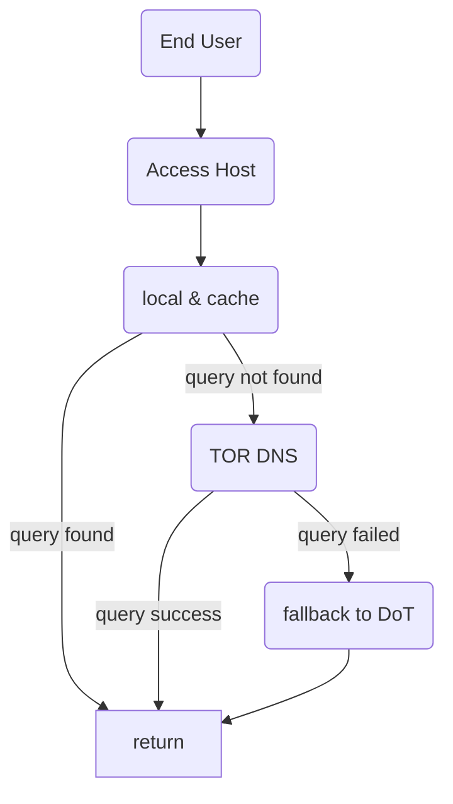

## Description
DNS server that having upstream resolver via TOR network. Only sole purpose to get IP from DNS. Packed with ads blocking and DNS query caching.

## Program

### Resolving flow

Here is our resolving flow

